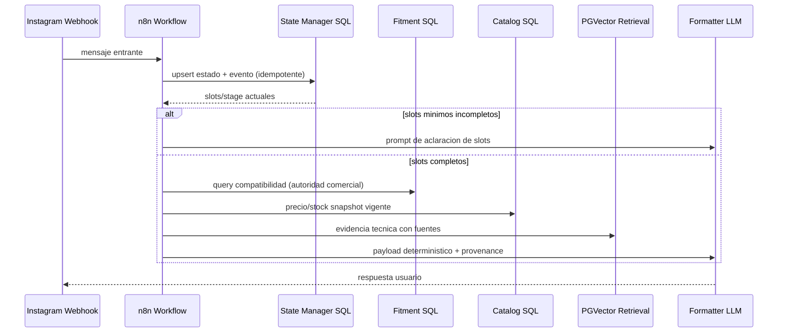

# Design: MVP Instagram vendedor Tecbite

## Technical Approach
Implementar un pipeline SQL-first con estado conversacional persistente por `conversation_id`, donde Instagram dispara n8n, n8n actualiza slots/etapa en PostgreSQL, resuelve fitment/catalogo por SQL canonico y solo usa RAG (`pgvector`) para soporte tecnico con fuente. Se reutilizan scripts ETL existentes (`scripts/etl.py`, `scripts/tecbite_catalog_etl.py`, `scripts/thule_docs_ingest.py`) y se refuerza `n8n/thule_rag_workflow.json` con nodos de state manager, guardrails y fallback.

## Architecture Decisions
| Decision | Option | Tradeoff | Chosen |
|---|---|---|---|
| Compatibilidad comercial | SQL canonico (`vehicles` + fitment) | Menor flexibilidad semantica, mayor precision/auditabilidad | Yes |
| Compatibilidad por embeddings | Similaridad vectorial para fitment | Mejor recall, alto riesgo de alucinacion comercial | No |
| Memoria conversacional | Estado explicito en tablas (`conversation_state`, `conversation_event`) | Mas DDL y queries, pero idempotencia/reintentos controlados | Yes |
| Memoria implicita LLM | Contexto solo en prompt | Menos persistencia, no determinista en reintentos | No |
| Catalogo en runtime directo al sitio | Scraping per request | Frescura alta, latencia y fragilidad elevadas | No |
| Catalogo por polling ETL | Snapshot versionado (`tecbite_catalog_snapshot`) | Frescura eventual, alta estabilidad operativa | Yes |

## Data Flow


## File Changes
| File | Action | Description |
|---|---|---|
| `openspec/changes/mvp-instagram-vendedor-tecbite/design.md` | Create | Diseno tecnico y decisiones cerradas del MVP. |
| `scripts/schema.sql` | Modify | DDL minimo para estado conversacional + indices de consulta critica. |
| `scripts/migrations/20260422_instagram_state.sql` | Create | Migracion versionada de tablas/indices de estado Instagram y metricas base. |
| `scripts/etl.py` | Modify | Endurecer contrato canonico de fitment y validaciones de carga. |
| `scripts/tecbite_catalog_etl.py` | Modify | Politica de snapshot (freshness, fallo controlado, metadata operativa). |
| `scripts/thule_docs_ingest.py` | Modify | Retrieval tecnico con umbral minimo de evidencia y metadata de fuente. |
| `scripts/sql_helpers.py` | Modify | Queries reutilizables para estado, fitment SQL-first y retrieval tecnico. |
| `n8n/thule_rag_workflow.json` | Modify | Trigger -> state manager -> slot filling -> SQL fitment/catalog -> RAG -> formatter + handoff. |

## Interfaces / Contracts
```sql
-- Minimo estado conversacional
CREATE TABLE instagram_conversation_state (
  conversation_id TEXT PRIMARY KEY,
  user_id TEXT NOT NULL,
  channel TEXT NOT NULL DEFAULT 'instagram',
  stage TEXT NOT NULL, -- collect_make|collect_model|collect_year|collect_category|recommend|handoff
  make TEXT,
  model TEXT,
  year INT,
  category TEXT,
  slots_complete BOOLEAN NOT NULL DEFAULT FALSE,
  last_message_id TEXT,
  updated_at TIMESTAMPTZ NOT NULL DEFAULT NOW()
);

CREATE TABLE instagram_conversation_event (
  id BIGSERIAL PRIMARY KEY,
  conversation_id TEXT NOT NULL,
  message_id TEXT NOT NULL,
  event_type TEXT NOT NULL, -- inbound|state_update|recommendation|handoff
  payload JSONB NOT NULL DEFAULT '{}'::jsonb,
  created_at TIMESTAMPTZ NOT NULL DEFAULT NOW(),
  UNIQUE (conversation_id, message_id, event_type)
);
```

Consultas criticas e indices:
- `upsert_state`: `INSERT ... ON CONFLICT (conversation_id) DO UPDATE` (PK cubre lookup principal).
- `idempotency_check`: `WHERE conversation_id=$1 AND message_id=$2` con indice `idx_event_conv_msg (conversation_id, message_id)`.
- `fitment_lookup`: `brand/model/year/category` con indice compuesto `idx_vehicle_fitment_lookup`.
- `latest_catalog`: `snapshot_at DESC` + `product_sku` (aprovecha `idx_tecbite_catalog_snapshot_snapshot_at` y `idx_tecbite_product_state_snapshot_desc`).
- `technical_rag`: `ORDER BY embedding <=> query_vector LIMIT k` (indice HNSW existente).

## Testing Strategy
| Layer | What to Test | Approach |
|---|---|---|
| Unit | Resolucion de stage, slot filling, guardrails SQL-first | Casos Python sobre funciones puras y SQL helpers. |
| Integration | Workflow n8n + Postgres (estado, fitment, catalogo, rag) | Smoke scripts con payloads Instagram reales/duplicados. |
| E2E | Conversacion completa con/ sin compatibilidad y fallback | Reproduccion controlada en ambiente staging con KPI diario. |

## Migration / Rollout
Rollout incremental:
1) DDL/migracion estado + queries helper (sin activar en workflow).
2) Activar state manager y slot filling en n8n con feature flag (`INSTAGRAM_STATE_ENABLED`).
3) Activar rama SQL fitment/catalog como autoridad comercial.
4) Activar retrieval vectorial tecnico con threshold y citacion de fuente.
5) Activar handoff humano automatico (`stage=handoff`) para baja evidencia, snapshot stale o conflictos.

Fallback/handoff humano:
- Sin slots minimos tras N interacciones -> handoff.
- Fitment sin match SQL -> respuesta no confirmada + handoff opcional.
- Catalogo stale >24h o error SQL -> no afirmar stock/precio, handoff.
- RAG bajo umbral -> declarar falta de evidencia y derivar asesor.

## Risks
- Divergencia entre `scripts/schema.sql` y migraciones reales (ya visible por tablas referenciadas en ETL): mitigar centralizando cambios en migraciones versionadas y aplicacion obligatoria `--run-migrations`.
- Secretos con defaults en scripts Python (`DB_PASS`, host): mitigar eliminando defaults sensibles y fail-fast por env faltante.
- Falta de suite de tests en repo: mitigar con smoke checklist automatizable por fase y KPIs diarios obligatorios.
- Dependencia de scraping web para catalogo: mitigar con umbrales de completitud/SKU y retencion del ultimo snapshot valido.

## Open Questions
- [ ] Definir SLA exacto de handoff humano (tiempo maximo de respuesta) por horario comercial.
